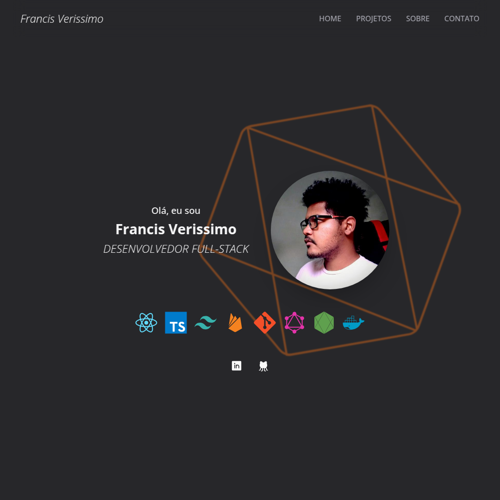
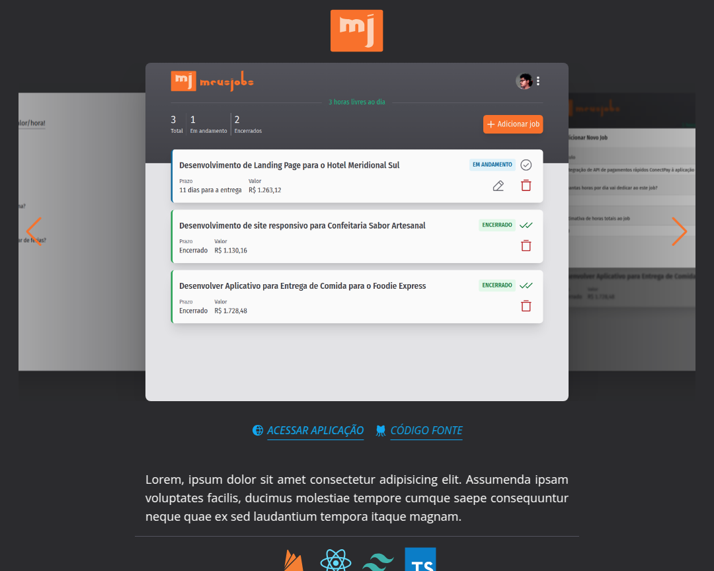
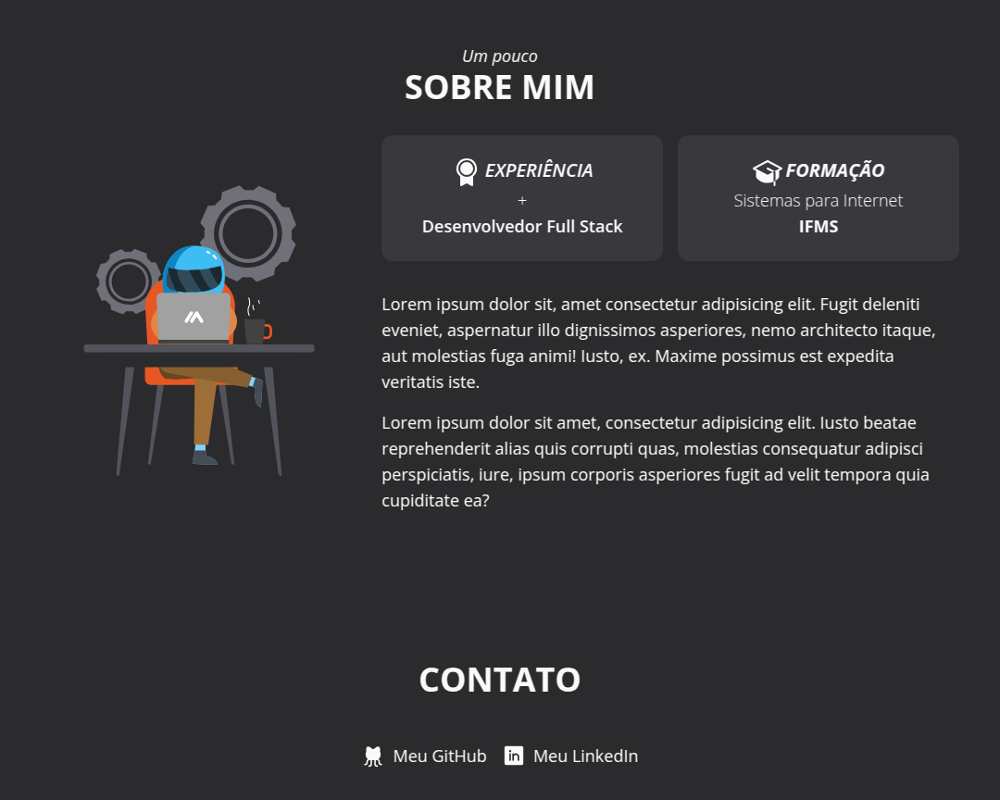

# portfolio

Este é o meu portfólio pessoal, desenvolvido para exibir meus projetos e habilidades como desenvolvedor. 

## 🛠 Tecnologias Utilizadas

- **React**: Utilizado para construir uma interface interativa e dinâmica.
- **TypeScript**: Garante tipagem estática para maior segurança e produtividade durante o desenvolvimento.
- **Tailwind CSS**: Framework de utilitário que possibilita estilização rápida e responsiva.
- **GitHub API**: Consome dados do meu perfil GitHub, informações pessoais e repositórios, e exibe essas informações de forma organizada na aplicação.

## 🚀 Acesse o Projeto

Você pode acessar o projeto online através do seguinte link:

[**Clique aqui para acessar**](https://francissportfolio.vercel.app/).

## 📸 Capturas de Tela
Algumas capturas de tela do projeto:

---

Feito com 💙 por [francisverissimo](https://francissportfolio.vercel.app/)