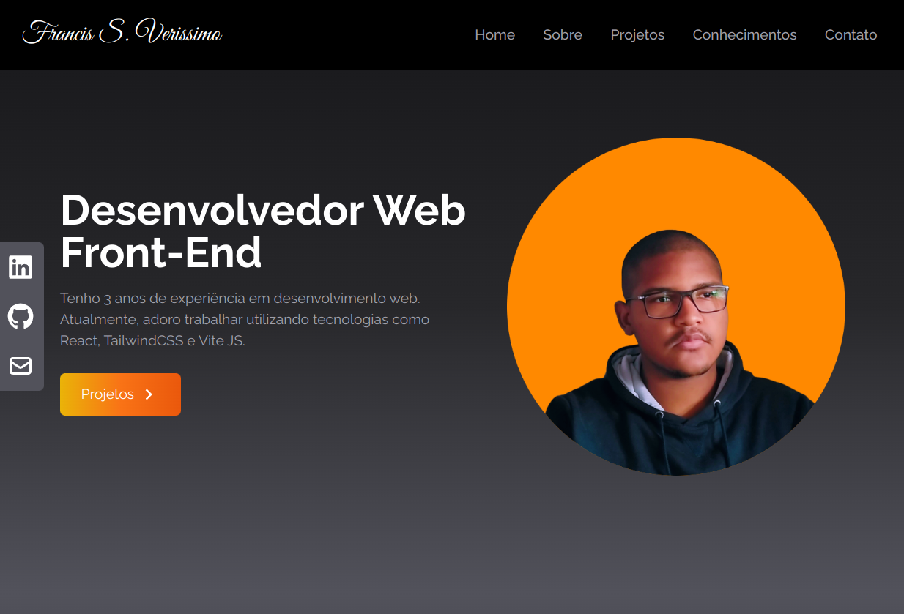

# Francis's Portfolio
My personal portfolio website

  

<h2>Site publicado <a href="https://francissportfolio.vercel.app/">aqui</a></h2>

## Tecnologias

Este projeto foi desenvolvido com React, TailwindCSS e Typescript.

  
  
  

## Projeto

  Meu portfolio pessoal.
  Contém as seguintes seções: Home, Sobre, Projetos, Conhecimentos e Contato

